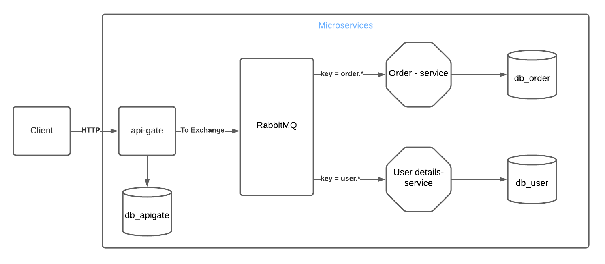

# Application for creating and processing orders

### Structure
##### The application consists of several services

* api-gate -
  Hotspot to Application via HTTP
* data-lib -
  Library of all common models
* user -
  Service for user details
* order - Service for working with orders
* db_order - Database for the service order
* db_user - Database for the service user
* db_apigate -Database for the service api-gate

### Getting Started

##### The application is built with the help of the gradle builder and work in Docker.
To run you need to run the following commands:

`gradle build`  
`gradle docker` - Docker images are built using the gradle plugin  

Then you need to run the docker-compose.yml file

